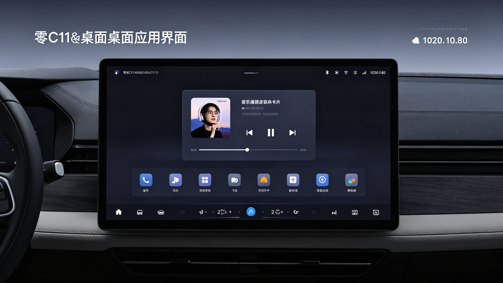
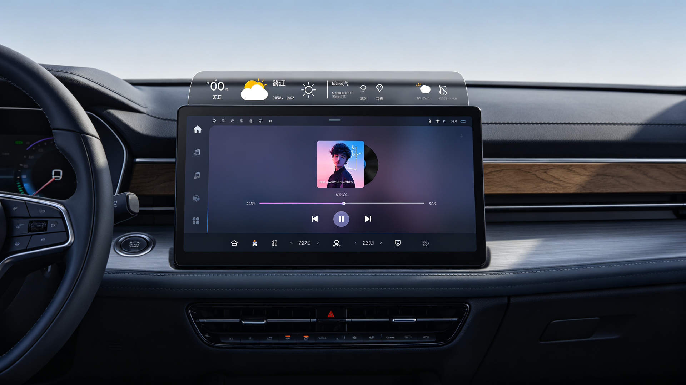
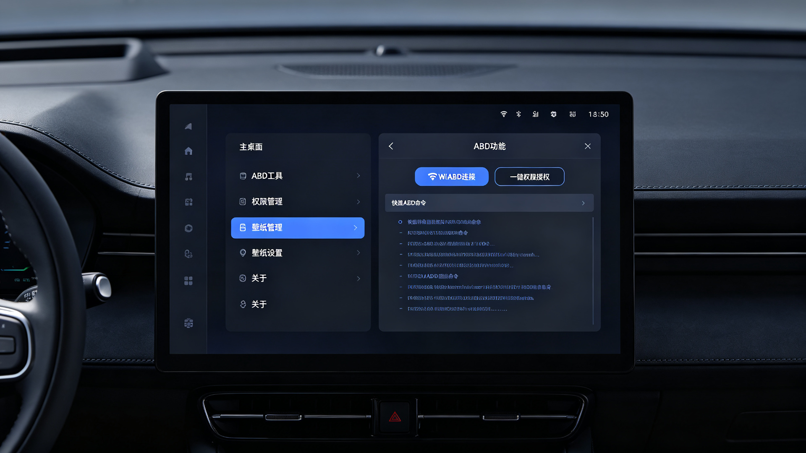

# C11Partner 零跑C11专属车载桌面系统

一个基于 Android 的开源车载桌面启动器，专为零跑C11车机系统深度定制。

---

## 📢 **项目最新动态**

### ✅ **v1.0.0 - 已完成 (2026-06-17)**
- ✅ 从 DiPartner 开源项目 fork 并定制化
- ✅ **全局包名重命名**：`com.dipartner.desktop` → `com.c11partner.desktop`
- ✅ 应用名称改为「C11伙伴」
- ✅ 天气模块默认经纬度改为河南商丘 (34.44, 115.65)
- ✅ GitHub Actions CI 自动构建配置完成
- ✅ 代码语法错误修复完成
- ✅ 项目已上传至 GitHub：https://github.com/Mariobolo/C11Partner

---

## 📸 **应用截图**

### 主界面


> 零跑C11专属车载桌面，深色主题设计，顶部显示时间日期和天气信息，中间音乐播放器卡片，底部应用快捷启动栏和空调控制面板。

---

### 天气与音乐播放


> 实时天气显示（默认商丘地区），音乐播放器支持主流音乐应用控制，空调温度精准调节。

---

### 设置与ADB工具


> ADB功能隐藏在设置二级菜单，仅作为高级增强功能。支持WiFi ADB自动连接、一键权限授权、常用ADB命令快捷执行。

---

## ✨ **项目简介**

C11Partner 是基于 DiPartner 开源项目定制的零跑C11专属车载桌面，针对零跑C11 Android 9 车机系统进行了深度优化和功能适配。

## 🚀 **已实现功能**

- 🎵 **音乐控制组件** - 支持主流音乐播放器的控制和显示
- 🌤️ **天气显示** - 实时天气信息展示（默认商丘地区）
- 🗺️ **地图导航快捷入口**
- ❄️ **空调控制面板**
- 🖼️ **壁纸切换系统**
- 📱 **快速启动应用**
- 🛞 **胎压监测显示**
- 🔧 **ADB一键权限授权**

## 🎯 **开发路线图 (Roadmap)**

### 📋 **v1.1.0 - 正在规划中**
#### 🔴 **高优先级**
- [ ] **ADB功能精简与重构（零跑专用）**
  - [ ] 核心功能完全不依赖ADB连接
  - [ ] ADB功能移至设置二级菜单
  - [ ] WiFi ADB自动检测与连接（5555端口）
  - [ ] 一键自我权限授权
  - [ ] 常用ADB命令快捷工具集

- [ ] **零跑C11日志状态监控系统**
  - [ ] Logcat实时日志抓取与解析
  - [ ] 车机系统状态监控（CPU、内存、温度）
  - [ ] 车辆CAN信号解析与显示
  - [ ] 故障码读取与告警
  - [ ] 转向灯/双闪状态监听

- [ ] **360环视PIP触发功能**
  - [ ] 打转向灯自动触发360全景
  - [ ] 倒车自动触发360全景
  - [ ] 低速（<15km/h）自动触发
  - [ ] PIP画中画模式优化

#### 🟡 **中优先级**
- [ ] **车机功能控制增强**
  - [ ] 空调温度/风量精准控制
  - [ ] 座椅加热/通风控制
  - [ ] 车窗/天窗控制
  - [ ] 氛围灯颜色调节
  - [ ] 驾驶模式切换

#### 🟢 **低优先级**
- [ ] **UI/UX整体美化**
  - [ ] 零跑C11专属主题配色
  - [ ] 动态壁纸支持
  - [ ] 卡片式布局优化
  - [ ] 动画效果增强
  - [ ] 暗黑模式适配

### 📋 **v1.2.0 - 远期规划**
- [ ] **自动化规则引擎**
  - [ ] 上车自动开空调（基于温度）
  - [ ] 下雨自动关窗
  - [ ] 夜间自动降低屏幕亮度
  - [ ] 充电状态提示
- [ ] **OTA在线更新**
- [ ] **用户配置云同步**
- [ ] **第三方插件系统**

---

## 🛠️ **技术栈**

- **前端**: HTML5 + CSS3 + JavaScript
- **后端**: Android Java (API 25+)
- **通信**: WebView Bridge 双向通信
- **数据库**: SQLite
- **目标平台**: 零跑C11 Android 9 (API 28)
- **CI/CD**: GitHub Actions 自动构建

## 📋 **系统要求**

- Android 7.1+ (API 25)
- 零跑C11车机推荐：Android 9 (API 28)

## 🔧 **快速开始**

### 1. 克隆项目
```bash
git clone https://github.com/Mariobolo/C11Partner.git
cd C11Partner
```

### 2. 配置环境
- Android Studio 4.2+
- JDK 17
- Android SDK 30

### 3. 构建项目
```bash
chmod +x gradlew
./gradlew assembleDebug
```

### 4. 安装到设备
```bash
adb install app/build/outputs/apk/debug/app-debug.apk
```

## 📁 **项目结构**

```
C11Partner/
├── app/
│   ├── src/main/
│   │   ├── assets/          # Web 前端资源
│   │   │   ├── css/         # 样式文件
│   │   │   ├── js/          # JavaScript 文件
│   │   │   ├── images/      # 图片资源
│   │   │   └── index.html   # 主页面
│   │   ├── java/            # Android Java 代码
│   │   │   ├── com.c11partner.desktop/
│   │   │   │   ├── adb/     # ADB 相关模块
│   │   │   │   ├── bridge/  # WebView 通信桥
│   │   │   │   ├── database/# 数据库模块
│   │   │   │   ├── service/ # 后台服务
│   │   │   │   ├── utils/   # 工具类
│   │   │   │   └── MainActivity.java
│   │   └── res/             # Android 资源
│   └── build.gradle         # 模块构建配置
├── .github/workflows/       # GitHub Actions CI
├── PROJECT_PLAN.md          # 详细项目开发计划
├── build.gradle             # 项目构建配置
└── README.md
```

## 🔑 **核心权限说明**

应用需要以下ADB授权权限以实现完整功能（零跑C11专用）：

```bash
# 1. 读取系统日志（用于车机状态监控、转向灯/档位监听、广播捕获）
adb shell pm grant com.c11partner.desktop android.permission.READ_LOGS

# 2. DUMP权限（获取系统状态、内存、CPU、Activity信息）
adb shell pm grant com.c11partner.desktop android.permission.DUMP

# 3. 写入系统设置（车控功能、Settings.Global属性、系统Intent发送）
adb shell pm grant com.c11partner.desktop android.permission.WRITE_SECURE_SETTINGS
```

> 💡 **零跑C11车控原理**：通过 `logcat` 捕获系统广播 + `Settings.Global` 读写系统属性 + `sendBroadcast` 发送车控Intent实现，无需比亚迪专用权限。**以上三个权限必须全部授予！**

## 🔏 **APK签名说明**

项目已内置签名文件 `app/dipartner.jks`，可直接构建Release版本：

- **签名文件**：`app/dipartner.jks`
- **密钥库密码**：`dipartner123`
- **密钥别名**：`dipartner`
- **密钥密码**：`dipartner123`

> ⚠️ **注意**：此为开发测试签名，正式发布请替换为您自己的签名文件！

## 📐 **代码规范**

为保证项目质量，我们遵循以下规范：

### Java 代码规范
- ✅ 使用驼峰命名法（camelCase）
- ✅ 类名使用大驼峰（PascalCase）
- ✅ 常量使用全大写下划线分隔
- ✅ 每个方法必须添加Javadoc注释
- ✅ 缩进使用4个空格
- ✅ 最大行宽120字符

### JavaScript 代码规范
- ✅ 使用ES6+语法
- ✅ 使用 `const` / `let` 替代 `var`
- ✅ 统一使用单引号
- ✅ 语句末尾加分号
- ✅ 缩进使用2个空格

### Git 提交规范
```
feat: 新功能
fix: 修复bug
docs: 文档更新
style: 代码格式调整
refactor: 重构
test: 测试相关
chore: 构建/工具链变动
```

## 🤝 **贡献指南**

欢迎提交 Issue 和 Pull Request！

1. Fork 本仓库
2. 创建特性分支 (`git checkout -b feature/AmazingFeature`)
3. 提交更改 (`git commit -m 'feat: Add some AmazingFeature'`)
4. 推送到分支 (`git push origin feature/AmazingFeature`)
5. 创建 Pull Request

## 📄 **开源协议**

本项目采用 [MIT](LICENSE) 协议开源。

## 🙏 **致谢**

- 感谢 DiPartner 原作者的开源项目
- 感谢所有为这个项目做出贡献的开发者

## 📞 **联系方式**

如有问题或建议，欢迎提交 Issue。

---

**🌟 如果这个项目对你有帮助，欢迎给个 Star 支持！**
